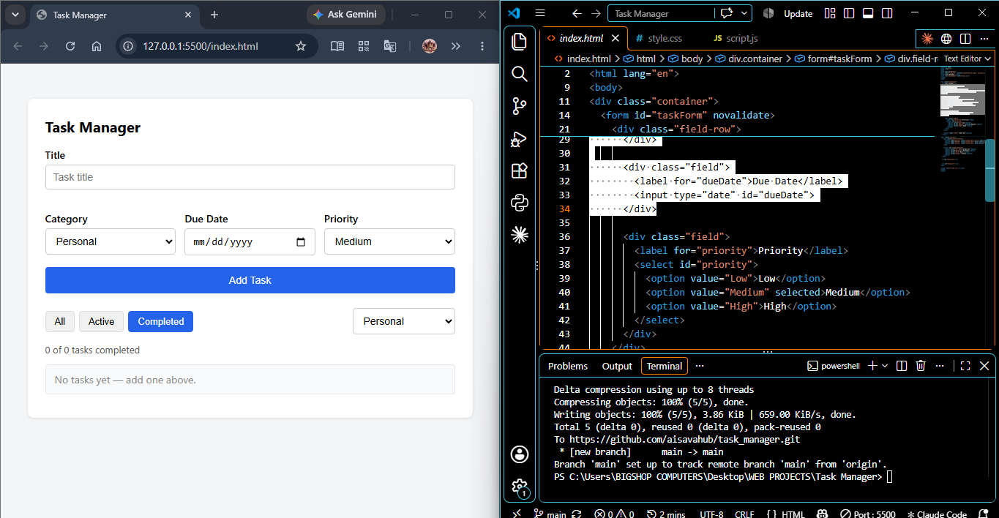

https://aisava-task-manager.netlify.app

# Task Manager

A responsive, persistent task management app built with vanilla JavaScript — create, filter, edit, complete, and delete tasks, with everything saved to `localStorage` so nothing is lost on refresh.

**Live demo:** [https://aisava-task-manager.netlify.app]

<!-- Replace with an actual screenshot or GIF of the app once deployed -->

## What it does

- Add tasks with a title, category, due date, and priority
- Mark tasks complete/incomplete, edit them in place, or delete them
- Filter tasks by status (All/Active/Completed) and category
- See a live stats summary (e.g., "3 of 10 tasks completed")
- Form validation blocks empty/invalid task submissions
- All data persists across page refreshes via `localStorage`

## Skills Practised

- DOM manipulation and event delegation
- Form handling and manual input validation
- `localStorage` + `JSON.stringify`/`JSON.parse` for persistence
- `try/catch` error handling for corrupted stored data
- Array methods (`filter`, `find`) for CRUD operations and filtering
- Edit-in-place UI pattern (tracking which item is actively being edited)
- Responsive design (mobile, tablet, desktop layouts)

## How to Run Locally

1. Clone this repo: `git clone [your-repo-url]`
2. Open `index.html` in your browser, or serve it with a local server
3. No build step, no dependencies

## What I'd Improve Next

<!-- Fill this in honestly — e.g., "Add due-date sorting" or "Move filter state into a cleaner pattern" -->
